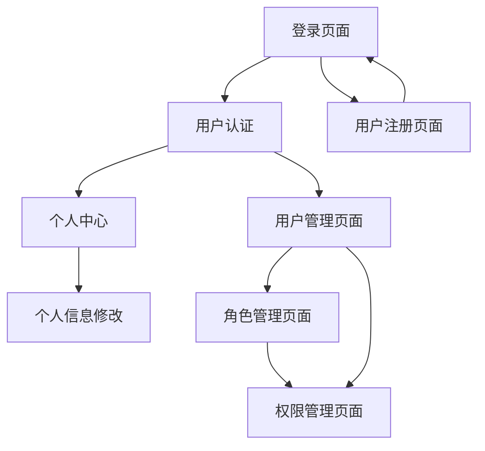

# Moon Business User 模块产品需求文档

## 1. Product Overview

Moon Business User 是一个基于 RBAC（Role-Based Access Control）权限模型的用户管理微服务模块，提供完整的用户认证、授权和权限管理功能。

该模块解决了微服务架构中统一用户管理和权限控制的问题，为整个 Moon Cloud 生态系统提供安全可靠的身份认证和访问控制服务。

目标是构建一个高性能、可扩展的企业级用户权限管理系统，支持分布式部署和横向扩展。

## 2. Core Features

### 2.1 User Roles

| Role | Registration Method | Core Permissions |
|------|---------------------|------------------|
| 系统管理员 | 系统初始化创建 | 完整的系统管理权限，包括用户管理、角色管理、权限配置 |
| 普通管理员 | 系统管理员邀请 | 用户管理、部分系统配置权限 |
| 普通用户 | 邮箱注册或管理员创建 | 基础功能访问权限，个人信息管理 |
| 访客用户 | 无需注册 | 仅可访问公开内容，功能受限 |

### 2.2 Feature Module

我们的用户管理系统包含以下主要页面：

1. **用户登录页面**：用户认证、JWT令牌生成、记住登录状态
2. **用户注册页面**：新用户注册、邮箱验证、初始角色分配
3. **用户管理页面**：用户列表、用户信息编辑、状态管理、角色分配
4. **角色管理页面**：角色创建、角色权限配置、角色分配管理
5. **权限管理页面**：权限定义、权限分组、权限继承关系
6. **个人中心页面**：个人信息修改、密码修改、登录历史查看

### 2.3 Page Details

| Page Name | Module Name | Feature description |
|-----------|-------------|---------------------|
| 用户登录页面 | 登录认证模块 | 支持用户名/邮箱登录，密码验证，JWT令牌生成，Redis会话存储，记住登录状态，登录失败限制 |
| 用户注册页面 | 用户注册模块 | 邮箱注册验证，密码强度检查，用户信息收集，默认角色分配，注册邮件发送 |
| 用户管理页面 | 用户管理模块 | 用户列表分页查询，用户信息CRUD操作，用户状态管理（启用/禁用），批量操作，角色分配 |
| 角色管理页面 | 角色管理模块 | 角色创建编辑，权限分配，角色层级管理，角色用户关联，角色状态管理 |
| 权限管理页面 | 权限管理模块 | 权限定义管理，权限分组，菜单权限配置，API权限配置，权限继承关系 |
| 个人中心页面 | 个人信息模块 | 个人资料修改，头像上传，密码修改，登录历史，安全设置，第三方账号绑定 |

## 3. Core Process

### 用户认证流程
用户通过登录页面输入凭据 → 系统验证用户信息 → 生成JWT令牌 → 将会话信息存储到Redis → 返回令牌给客户端 → 客户端后续请求携带令牌 → 系统验证令牌有效性和权限

### 权限验证流程
用户发起请求 → 拦截器提取JWT令牌 → 验证令牌有效性 → 从Redis获取用户会话信息 → 检查用户角色和权限 → 允许或拒绝访问

### 用户管理流程
管理员登录系统 → 访问用户管理页面 → 查看用户列表 → 创建/编辑用户信息 → 分配角色权限 → 保存变更

## 4. User Interface Design

### 4.1 Design Style

- **主色调**：#1890ff（蓝色）作为主色，#f0f2f5（浅灰）作为背景色
- **辅助色**：#52c41a（成功绿）、#faad14（警告黄）、#ff4d4f（错误红）
- **按钮样式**：圆角按钮设计，主按钮使用主色调，次要按钮使用边框样式
- **字体**：系统默认字体，标题使用16px-20px，正文使用14px，辅助文字使用12px
- **布局风格**：卡片式布局，左侧导航菜单，顶部面包屑导航
- **图标风格**：使用Ant Design图标库，简洁现代的线性图标

### 4.2 Page Design Overview

| Page Name | Module Name | UI Elements |
|-----------|-------------|-------------|
| 用户登录页面 | 登录表单 | 居中卡片布局，蓝色渐变背景，白色登录卡片，圆角输入框，蓝色登录按钮，记住密码复选框 |
| 用户管理页面 | 用户列表 | 表格布局，搜索筛选栏，分页组件，操作按钮组，状态标签，头像展示 |
| 角色管理页面 | 角色配置 | 左右分栏布局，左侧角色树，右侧权限配置面板，拖拽排序，权限树形结构 |
| 权限管理页面 | 权限树 | 树形结构展示，可展开折叠，权限图标，层级缩进，操作按钮 |
| 个人中心页面 | 信息展示 | 标签页布局，头像上传区域，表单输入，历史记录表格 |

### 4.3 Responsiveness

系统采用桌面优先的响应式设计，支持1200px以上的桌面端显示，同时适配平板设备（768px-1200px）。移动端（768px以下）提供基础的查看功能，主要管理操作建议在桌面端进行。支持触摸操作优化，包括按钮大小调整和手势操作。