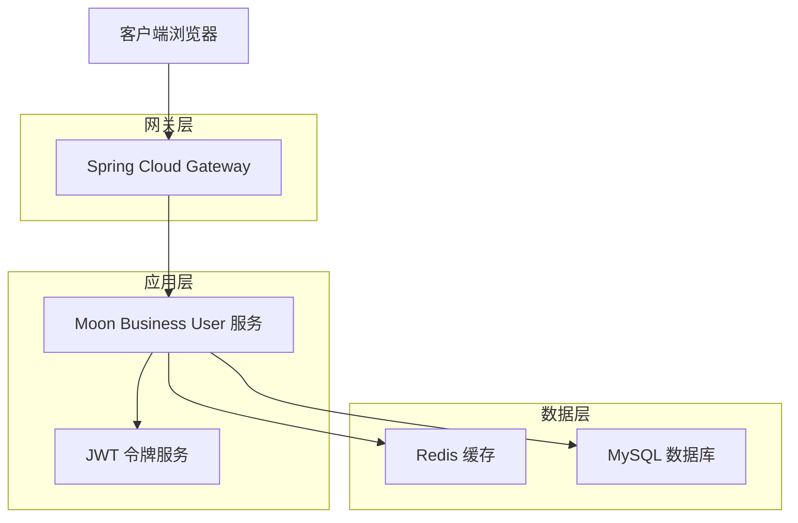
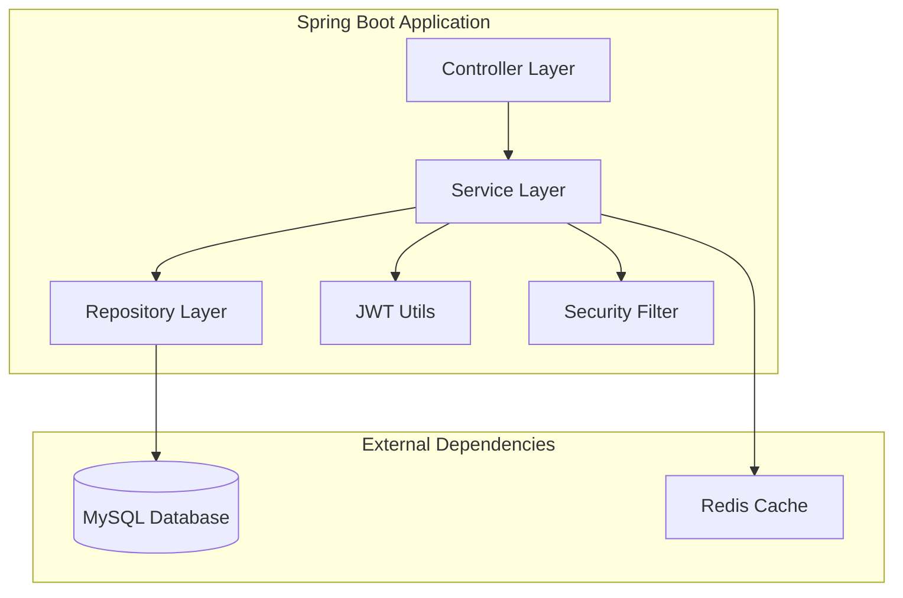
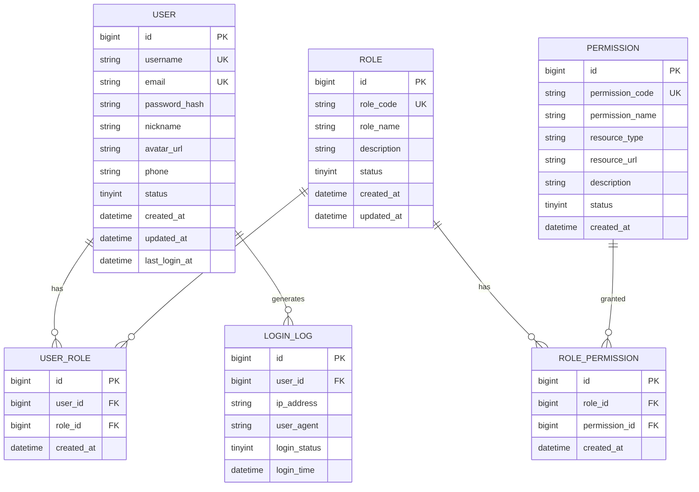

# Moon Business User 模块技术架构文档

## 1. Architecture design



## 2. Technology Description

* **Frontend**: React\@18 + Ant Design\@5 + TypeScript + Vite

* **Backend**: Spring Boot\@3.4.1 + Spring Security\@6 + Spring Cloud\@2023.0.0

* **Database**: MySQL\@8.0 + MyBatis Plus\@3.5.12

* **Cache**: Redis\@7.0 + Spring Data Redis

* **Authentication**: JWT + Spring Security

* **Build Tool**: Maven\@3.9

## 3. Route definitions

| Route        | Purpose          |
| ------------ | ---------------- |
| /login       | 用户登录页面，处理用户认证    |
| /register    | 用户注册页面，新用户注册流程   |
| /dashboard   | 用户仪表板，显示个人信息概览   |
| /users       | 用户管理页面，管理员用户管理功能 |
| /roles       | 角色管理页面，角色和权限配置   |
| /permissions | 权限管理页面，系统权限定义    |
| /profile     | 个人中心页面，个人信息管理    |

## 4. API definitions

### 4.1 Core API

**用户认证相关**

```
POST /api/auth/login
```

Request:

| Param Name | Param Type | isRequired | Description |
| ---------- | ---------- | ---------- | ----------- |
| username   | string     | true       | 用户名或邮箱      |
| password   | string     | true       | 用户密码        |
| rememberMe | boolean    | false      | 是否记住登录状态    |

Response:

| Param Name   | Param Type | Description |
| ------------ | ---------- | ----------- |
| success      | boolean    | 登录是否成功      |
| token        | string     | JWT访问令牌     |
| refreshToken | string     | 刷新令牌        |
| userInfo     | object     | 用户基本信息      |

Example:

```json
{
  "username": "admin@example.com",
  "password": "123456",
  "rememberMe": true
}
```

**用户管理相关**

```
GET /api/users
```

Request:

| Param Name | Param Type | isRequired | Description |
| ---------- | ---------- | ---------- | ----------- |
| page       | integer    | false      | 页码，默认1      |
| size       | integer    | false      | 每页大小，默认10   |
| keyword    | string     | false      | 搜索关键词       |
| status     | string     | false      | 用户状态筛选      |

Response:

| Param Name | Param Type | Description |
| ---------- | ---------- | ----------- |
| success    | boolean    | 请求是否成功      |
| data       | object     | 分页数据        |
| total      | integer    | 总记录数        |
| users      | array      | 用户列表        |

**角色权限相关**

```
POST /api/roles
```

Request:

| Param Name  | Param Type | isRequired | Description |
| ----------- | ---------- | ---------- | ----------- |
| roleName    | string     | true       | 角色名称        |
| description | string     | false      | 角色描述        |
| permissions | array      | true       | 权限ID列表      |
| status      | string     | false      | 角色状态        |

Response:

| Param Name | Param Type | Description |
| ---------- | ---------- | ----------- |
| success    | boolean    | 创建是否成功      |
| roleId     | string     | 新创建的角色ID    |
| message    | string     | 响应消息        |

## 5. Server architecture diagram



## 6. Data model

### 6.1 Data model definition



### 6.2 Data Definition Language

**用户表 (sys\_user)**

```sql
-- 创建用户表
CREATE TABLE sys_user (
    id BIGINT PRIMARY KEY AUTO_INCREMENT COMMENT '用户ID',
    username VARCHAR(50) NOT NULL UNIQUE COMMENT '用户名',
    email VARCHAR(100) NOT NULL UNIQUE COMMENT '邮箱',
    password_hash VARCHAR(255) NOT NULL COMMENT '密码哈希',
    nickname VARCHAR(50) COMMENT '昵称',
    avatar_url VARCHAR(255) COMMENT '头像URL',
    phone VARCHAR(20) COMMENT '手机号',
    status TINYINT DEFAULT 1 COMMENT '状态：0-禁用，1-启用',
    created_at DATETIME DEFAULT CURRENT_TIMESTAMP COMMENT '创建时间',
    updated_at DATETIME DEFAULT CURRENT_TIMESTAMP ON UPDATE CURRENT_TIMESTAMP COMMENT '更新时间',
    last_login_at DATETIME COMMENT '最后登录时间'
) COMMENT='用户表';

-- 创建索引
CREATE INDEX idx_user_email ON sys_user(email);
CREATE INDEX idx_user_status ON sys_user(status);
CREATE INDEX idx_user_created_at ON sys_user(created_at);
```

**角色表 (sys\_role)**

```sql
-- 创建角色表
CREATE TABLE sys_role (
    id BIGINT PRIMARY KEY AUTO_INCREMENT COMMENT '角色ID',
    role_code VARCHAR(50) NOT NULL UNIQUE COMMENT '角色编码',
    role_name VARCHAR(50) NOT NULL COMMENT '角色名称',
    description VARCHAR(255) COMMENT '角色描述',
    status TINYINT DEFAULT 1 COMMENT '状态：0-禁用，1-启用',
    created_at DATETIME DEFAULT CURRENT_TIMESTAMP COMMENT '创建时间',
    updated_at DATETIME DEFAULT CURRENT_TIMESTAMP ON UPDATE CURRENT_TIMESTAMP COMMENT '更新时间'
) COMMENT='角色表';

-- 创建索引
CREATE INDEX idx_role_code ON sys_role(role_code);
CREATE INDEX idx_role_status ON sys_role(status);
```

**权限表 (sys\_permission)**

```sql
-- 创建权限表
CREATE TABLE sys_permission (
    id BIGINT PRIMARY KEY AUTO_INCREMENT COMMENT '权限ID',
    permission_code VARCHAR(100) NOT NULL UNIQUE COMMENT '权限编码',
    permission_name VARCHAR(100) NOT NULL COMMENT '权限名称',
    resource_type VARCHAR(20) NOT NULL COMMENT '资源类型：MENU-菜单，BUTTON-按钮，API-接口',
    resource_url VARCHAR(255) COMMENT '资源URL',
    description VARCHAR(255) COMMENT '权限描述',
    status TINYINT DEFAULT 1 COMMENT '状态：0-禁用，1-启用',
    created_at DATETIME DEFAULT CURRENT_TIMESTAMP COMMENT '创建时间'
) COMMENT='权限表';

-- 创建索引
CREATE INDEX idx_permission_code ON sys_permission(permission_code);
CREATE INDEX idx_permission_type ON sys_permission(resource_type);
```

**用户角色关联表 (sys\_user\_role)**

```sql
-- 创建用户角色关联表
CREATE TABLE sys_user_role (
    id BIGINT PRIMARY KEY AUTO_INCREMENT COMMENT '关联ID',
    user_id BIGINT NOT NULL COMMENT '用户ID',
    role_id BIGINT NOT NULL COMMENT '角色ID',
    created_at DATETIME DEFAULT CURRENT_TIMESTAMP COMMENT '创建时间',
    UNIQUE KEY uk_user_role (user_id, role_id)
) COMMENT='用户角色关联表';

-- 创建索引
CREATE INDEX idx_user_role_user_id ON sys_user_role(user_id);
CREATE INDEX idx_user_role_role_id ON sys_user_role(role_id);
```

**角色权限关联表 (sys\_role\_permission)**

```sql
-- 创建角色权限关联表
CREATE TABLE sys_role_permission (
    id BIGINT PRIMARY KEY AUTO_INCREMENT COMMENT '关联ID',
    role_id BIGINT NOT NULL COMMENT '角色ID',
    permission_id BIGINT NOT NULL COMMENT '权限ID',
    created_at DATETIME DEFAULT CURRENT_TIMESTAMP COMMENT '创建时间',
    UNIQUE KEY uk_role_permission (role_id, permission_id)
) COMMENT='角色权限关联表';

-- 创建索引
CREATE INDEX idx_role_permission_role_id ON sys_role_permission(role_id);
CREATE INDEX idx_role_permission_permission_id ON sys_role_permission(permission_id);
```

**登录日志表 (sys\_login\_log)**

```sql
-- 创建登录日志表
CREATE TABLE sys_login_log (
    id BIGINT PRIMARY KEY AUTO_INCREMENT COMMENT '日志ID',
    user_id BIGINT COMMENT '用户ID',
    ip_address VARCHAR(50) COMMENT 'IP地址',
    user_agent VARCHAR(500) COMMENT '用户代理',
    login_status TINYINT NOT NULL COMMENT '登录状态：0-失败，1-成功',
    login_time DATETIME DEFAULT CURRENT_TIMESTAMP COMMENT '登录时间'
) COMMENT='登录日志表';

-- 创建索引
CREATE INDEX idx_login_log_user_id ON sys_login_log(user_id);
CREATE INDEX idx_login_log_time ON sys_login_log(login_time);
CREATE INDEX idx_login_log_status ON sys_login_log(login_status);
```

**初始化数据**

```sql
-- 插入默认角色
INSERT INTO sys_role (role_code, role_name, description) VALUES 
('ROLE_ADMIN', '系统管理员', '拥有系统所有权限'),
('ROLE_USER', '普通用户', '基础用户权限');

-- 插入默认权限
INSERT INTO sys_permission (permission_code, permission_name, resource_type, resource_url, description) VALUES 
('user:list', '用户列表查看', 'API', '/api/users', '查看用户列表'),
('user:create', '用户创建', 'API', '/api/users', '创建新用户'),
('user:update', '用户更新', 'API', '/api/users/*', '更新用户信息'),
('user:delete', '用户删除', 'API', '/api/users/*', '删除用户'),
('role:list', '角色列表查看', 'API', '/api/roles', '查看角色列表'),
('role:create', '角色创建', 'API', '/api/roles', '创建新角色'),
('role:update', '角色更新', 'API', '/api/roles/*', '更新角色信息'),
('role:delete', '角色删除', 'API', '/api/roles/*', '删除角色');

-- 插入默认管理员用户
INSERT INTO sys_user (username, email, password_hash, nickname, status) VALUES 
('admin', 'admin@mooncloud.com', '$2a$10$N.zmdr9k7uOCQb376NoUnuTJ8iKVjzieMwkOBSaEwHbNvVe.Ck6Oy', '系统管理员', 1);

-- 分配管理员角色
INSERT INTO sys_user_role (user_id, role_id) VALUES (1, 1);

-- 分配管理员权限
INSERT INTO sys_role_permission (role_id, permission_id) 
SELECT 1, id FROM sys_permission;
```

