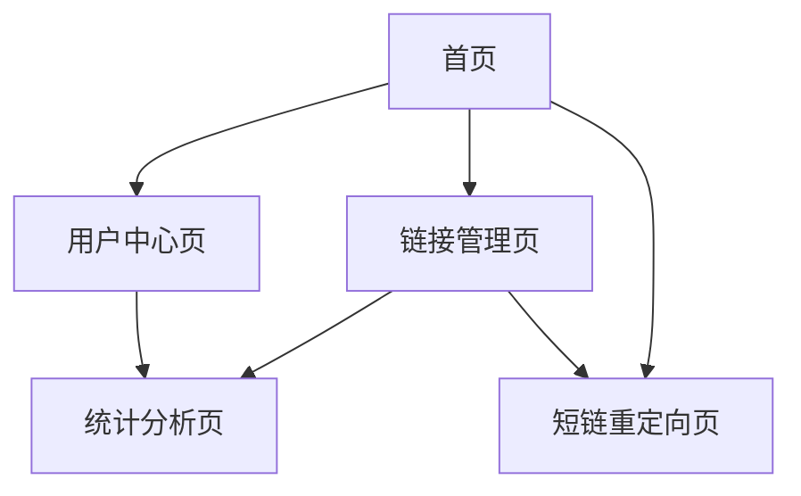

# 短URL系统设计文档

## 1. 产品概述

短URL系统是一个将长URL转换为短URL的在线服务，用户可以通过短URL快速访问原始长URL，同时提供访问统计和管理功能。
- 解决长URL在社交媒体、短信等场景中不便分享的问题，为个人用户、企业营销人员和开发者提供便捷的链接管理服务。
- 目标成为类似bit.ly、tinyurl等主流短链服务的竞争产品，服务百万级用户的链接缩短需求。

## 2. 核心功能

### 2.1 用户角色

| 角色 | 注册方式 | 核心权限 |
|------|----------|----------|
| 游客用户 | 无需注册 | 可创建临时短链，有效期7天，无统计功能 |
| 注册用户 | 邮箱注册 | 可创建永久短链，查看访问统计，管理链接 |
| 高级用户 | 付费升级 | 自定义短链后缀，高级统计分析，批量操作 |

### 2.2 功能模块

我们的短URL系统包含以下主要页面：
1. **首页**：URL输入框、短链生成、功能介绍
2. **链接管理页**：链接列表、编辑删除、批量操作
3. **统计分析页**：访问数据、图表展示、导出功能
4. **用户中心页**：账户信息、套餐管理、API密钥
5. **短链重定向页**：URL解析、访问记录、跳转处理

### 2.3 页面详情

| 页面名称 | 模块名称 | 功能描述 |
|----------|----------|----------|
| 首页 | URL输入模块 | 输入长URL，验证URL格式，生成短链接 |
| 首页 | 短链展示模块 | 显示生成的短链，提供复制功能，显示二维码 |
| 首页 | 功能介绍模块 | 展示产品特性，用户注册引导，价格方案 |
| 链接管理页 | 链接列表模块 | 显示用户创建的所有短链，支持搜索和筛选 |
| 链接管理页 | 链接操作模块 | 编辑链接标题，删除链接，批量管理操作 |
| 链接管理页 | 自定义短链模块 | 设置自定义后缀，检查可用性，保存设置 |
| 统计分析页 | 数据概览模块 | 显示总点击数，今日访问，热门链接排行 |
| 统计分析页 | 图表分析模块 | 访问趋势图，地理分布，设备统计，来源分析 |
| 统计分析页 | 数据导出模块 | 选择时间范围，导出CSV/Excel格式数据 |
| 用户中心页 | 账户信息模块 | 修改个人信息，更改密码，账户安全设置 |
| 用户中心页 | 套餐管理模块 | 查看当前套餐，升级付费版，使用量统计 |
| 用户中心页 | API管理模块 | 生成API密钥，查看API文档，调用次数统计 |
| 短链重定向页 | URL解析模块 | 根据短链查找原始URL，验证链接有效性 |
| 短链重定向页 | 访问记录模块 | 记录访问时间，IP地址，用户代理，来源页面 |
| 短链重定向页 | 跳转处理模块 | 执行302重定向，处理失效链接，显示错误页面 |

## 3. 核心流程

**游客用户流程：**
用户访问首页 → 输入长URL → 系统生成短链 → 用户复制使用短链 → 访问者点击短链 → 系统重定向到原始URL

**注册用户流程：**
用户注册登录 → 创建短链 → 管理链接列表 → 查看访问统计 → 自定义短链后缀 → 导出统计数据

**高级用户流程：**
付费用户登录 → 批量创建短链 → 设置自定义域名 → 查看高级统计 → 使用API接口 → 管理团队权限



## 4. 用户界面设计

### 4.1 设计风格

- **主色调**：蓝色(#2563EB)作为主色，白色(#FFFFFF)作为背景色
- **辅助色**：灰色(#6B7280)用于次要文本，绿色(#10B981)用于成功状态
- **按钮样式**：圆角矩形按钮，悬停时有阴影效果
- **字体**：中文使用苹方/微软雅黑，英文使用Inter/Roboto，主要字号16px
- **布局风格**：卡片式设计，顶部导航栏，响应式网格布局
- **图标风格**：线性图标风格，统一使用Heroicons图标库

### 4.2 页面设计概览

| 页面名称 | 模块名称 | UI元素 |
|----------|----------|--------|
| 首页 | URL输入模块 | 大尺寸输入框，蓝色渐变背景，居中布局，"生成短链"按钮 |
| 首页 | 短链展示模块 | 卡片容器，短链文本框，复制按钮，二维码图标，分享按钮组 |
| 链接管理页 | 链接列表模块 | 表格布局，分页组件，搜索框，筛选下拉菜单，操作按钮组 |
| 统计分析页 | 图表分析模块 | Chart.js图表，数据卡片，时间选择器，颜色编码图例 |
| 用户中心页 | 账户信息模块 | 表单布局，头像上传，输入验证，保存按钮，安全徽章 |
| 短链重定向页 | 跳转处理模块 | 加载动画，倒计时显示，错误提示页面，重试按钮 |

### 4.3 响应式设计

系统采用移动优先的响应式设计，支持桌面端、平板和手机端访问，针对触屏设备优化按钮大小和交互体验。

## 5. 功能性需求详细分析

### 5.1 URL缩短功能
- **输入验证**：支持HTTP/HTTPS协议，验证URL格式合法性，检测恶意链接
- **短链生成**：使用Base62编码算法，生成6-8位短链标识符
- **重复处理**：相同URL生成相同短链，避免重复存储
- **自定义短链**：高级用户可自定义短链后缀，检查唯一性

#### 5.1.7 短URL生成算法实现

Base62编码算法

使用62个字符（0-9, a-z, A-Z）进行编码，将长整型ID压缩为短字符串，支持编码/解码和指定长度补零功能，6位Base62可表示约568亿个不同的短链

**Base62编码算法**
```java
@Component
public class Base62Encoder {
    
    private static final String BASE62_CHARS = "0123456789abcdefghijklmnopqrstuvwxyzABCDEFGHIJKLMNOPQRSTUVWXYZ";
    private static final int BASE = 62;
    
    /**
     * 将数字ID编码为Base62字符串
     */
    public String encode(long id) {
        if (id == 0) {
            return "0";
        }
        
        StringBuilder sb = new StringBuilder();
        while (id > 0) {
            sb.append(BASE62_CHARS.charAt((int) (id % BASE)));
            id /= BASE;
        }
        
        return sb.reverse().toString();
    }
    
    /**
     * 将Base62字符串解码为数字ID
     */
    public long decode(String shortUrl) {
        long result = 0;
        long power = 1;
        
        for (int i = shortUrl.length() - 1; i >= 0; i--) {
            char c = shortUrl.charAt(i);
            int index = BASE62_CHARS.indexOf(c);
            if (index == -1) {
                throw new IllegalArgumentException("无效的Base62字符: " + c);
            }
            result += index * power;
            power *= BASE;
        }
        
        return result;
    }
    
    /**
     * 生成指定长度的短链（补零）
     */
    public String encodeWithPadding(long id, int minLength) {
        String encoded = encode(id);
        if (encoded.length() >= minLength) {
            return encoded;
        }
        
        StringBuilder sb = new StringBuilder();
        for (int i = 0; i < minLength - encoded.length(); i++) {
            sb.append('0');
        }
        sb.append(encoded);
        
        return sb.toString();
    }
}
```

**Snowflake分布式ID生成器**

64位ID结构：1位符号位 + 41位时间戳 + 10位机器ID + 12位序列号，支持1024台机器，每毫秒可生成4096个ID

包含时钟回拨检测和处理机制

保证分布式环境下ID的全局唯一性


```java
@Component
public class SnowflakeIdGenerator {
    
    // 起始时间戳 (2024-01-01)
    private static final long START_TIMESTAMP = 1704067200000L;
    
    // 各部分位数
    private static final long SEQUENCE_BITS = 12;
    private static final long MACHINE_BITS = 10;
    private static final long TIMESTAMP_BITS = 41;
    
    // 最大值
    private static final long MAX_SEQUENCE = (1L << SEQUENCE_BITS) - 1;
    private static final long MAX_MACHINE_ID = (1L << MACHINE_BITS) - 1;
    
    // 位移
    private static final long MACHINE_SHIFT = SEQUENCE_BITS;
    private static final long TIMESTAMP_SHIFT = SEQUENCE_BITS + MACHINE_BITS;
    
    private final long machineId;
    private long sequence = 0L;
    private long lastTimestamp = -1L;
    
    public SnowflakeIdGenerator(@Value("${app.machine-id:1}") long machineId) {
        if (machineId > MAX_MACHINE_ID || machineId < 0) {
            throw new IllegalArgumentException("机器ID超出范围: " + machineId);
        }
        this.machineId = machineId;
    }
    
    /**
     * 生成唯一ID
     */
    public synchronized long nextId() {
        long timestamp = getCurrentTimestamp();
        
        // 时钟回拨检查
        if (timestamp < lastTimestamp) {
            throw new RuntimeException("时钟回拨，拒绝生成ID");
        }
        
        // 同一毫秒内序列号递增
        if (timestamp == lastTimestamp) {
            sequence = (sequence + 1) & MAX_SEQUENCE;
            if (sequence == 0) {
                // 序列号溢出，等待下一毫秒
                timestamp = waitNextMillis(lastTimestamp);
            }
        } else {
            sequence = 0L;
        }
        
        lastTimestamp = timestamp;
        
        // 组装ID
        return ((timestamp - START_TIMESTAMP) << TIMESTAMP_SHIFT)
                | (machineId << MACHINE_SHIFT)
                | sequence;
    }
    
    private long getCurrentTimestamp() {
        return System.currentTimeMillis();
    }
    
    private long waitNextMillis(long lastTimestamp) {
        long timestamp = getCurrentTimestamp();
        while (timestamp <= lastTimestamp) {
            timestamp = getCurrentTimestamp();
        }
        return timestamp;
    }
}
```

**短链生成服务**

重复URL处理 ：使用MD5哈希检测重复，相同URL返回相同短链

多层检查机制 ：布隆过滤器 → 缓存 → 数据库

冲突处理 ：支持重试机制，最多重试3次

自定义短链 ：支持用户自定义，包含格式验证和保留字检查

```java
@Service
@Slf4j
public class ShortUrlGeneratorService {
    
    @Autowired
    private Base62Encoder base62Encoder;
    
    @Autowired
    private SnowflakeIdGenerator snowflakeIdGenerator;
    
    @Autowired
    private UrlMappingRepository urlMappingRepository;
    
    @Autowired
    private RedisTemplate<String, Object> redisTemplate;
    
    @Autowired
    private BloomFilter<String> urlBloomFilter;
    
    private static final String URL_HASH_PREFIX = "url_hash:";
    private static final String SHORT_URL_PREFIX = "short_url:";
    private static final int DEFAULT_SHORT_URL_LENGTH = 6;
    private static final int MAX_RETRY_COUNT = 3;
    
    /**
     * 生成短链
     */
    @Transactional
    public ShortUrlResult generateShortUrl(String originalUrl, String customShortUrl, Long userId) {
        try {
            // 1. URL标准化
            String normalizedUrl = normalizeUrl(originalUrl);
            
            // 2. 检查是否已存在
            String urlHash = DigestUtils.md5Hex(normalizedUrl);
            UrlMappingEntity existingMapping = checkExistingUrl(urlHash);
            if (existingMapping != null) {
                return ShortUrlResult.success(existingMapping.getShortUrl(), false);
            }
            
            // 3. 生成短链
            String shortUrl;
            if (StringUtils.isNotBlank(customShortUrl)) {
                // 自定义短链
                shortUrl = generateCustomShortUrl(customShortUrl);
            } else {
                // 系统生成短链
                shortUrl = generateSystemShortUrl();
            }
            
            // 4. 保存映射关系
            UrlMappingEntity mapping = new UrlMappingEntity();
            mapping.setShortUrl(shortUrl);
            mapping.setOriginalUrl(normalizedUrl);
            mapping.setUrlHash(urlHash);
            mapping.setUserId(userId);
            mapping.setCreatedAt(new Date());
            mapping.setExpiresAt(calculateExpiryDate());
            mapping.setClickCount(0L);
            mapping.setStatus(UrlStatus.ACTIVE);
            
            urlMappingRepository.save(mapping);
            
            // 5. 更新缓存和布隆过滤器
            updateCache(shortUrl, normalizedUrl);
            urlBloomFilter.put(normalizedUrl);
            
            log.info("短链生成成功: {} -> {}", normalizedUrl, shortUrl);
            return ShortUrlResult.success(shortUrl, true);
            
        } catch (Exception e) {
            log.error("短链生成失败: {}", e.getMessage(), e);
            return ShortUrlResult.failure("短链生成失败: " + e.getMessage());
        }
    }
    
    /**
     * 检查URL是否已存在
     */
    private UrlMappingEntity checkExistingUrl(String urlHash) {
        // 1. 布隆过滤器快速检查
        if (!urlBloomFilter.mightContain(urlHash)) {
            return null;
        }
        
        // 2. 缓存检查
        String cacheKey = URL_HASH_PREFIX + urlHash;
        String cachedShortUrl = (String) redisTemplate.opsForValue().get(cacheKey);
        if (StringUtils.isNotBlank(cachedShortUrl)) {
            return urlMappingRepository.findByShortUrl(cachedShortUrl);
        }
        
        // 3. 数据库查询
        return urlMappingRepository.findByUrlHash(urlHash);
    }
    
    /**
     * 生成系统短链
     */
    private String generateSystemShortUrl() {
        for (int retry = 0; retry < MAX_RETRY_COUNT; retry++) {
            try {
                // 使用Snowflake生成唯一ID
                long id = snowflakeIdGenerator.nextId();
                
                // Base62编码
                String shortUrl = base62Encoder.encodeWithPadding(id, DEFAULT_SHORT_URL_LENGTH);
                
                // 检查冲突
                if (!urlMappingRepository.existsByShortUrl(shortUrl)) {
                    return shortUrl;
                }
                
                log.warn("短链冲突，重试: {}", shortUrl);
                
            } catch (Exception e) {
                log.error("生成短链异常，重试: {}", e.getMessage());
            }
        }
        
        throw new RuntimeException("短链生成失败，超过最大重试次数");
    }
    
    /**
     * 生成自定义短链
     */
    private String generateCustomShortUrl(String customShortUrl) {
        // 1. 验证自定义短链格式
        if (!isValidCustomShortUrl(customShortUrl)) {
            throw new IllegalArgumentException("自定义短链格式不正确");
        }
        
        // 2. 检查是否已被使用
        if (urlMappingRepository.existsByShortUrl(customShortUrl)) {
            throw new IllegalArgumentException("自定义短链已被使用");
        }
        
        // 3. 检查是否为保留字
        if (isReservedShortUrl(customShortUrl)) {
            throw new IllegalArgumentException("自定义短链为系统保留字");
        }
        
        return customShortUrl;
    }
    
    /**
     * 验证自定义短链格式
     */
    private boolean isValidCustomShortUrl(String shortUrl) {
        if (StringUtils.isBlank(shortUrl)) {
            return false;
        }
        
        // 长度限制
        if (shortUrl.length() < 3 || shortUrl.length() > 20) {
            return false;
        }
        
        // 字符限制：只允许字母、数字、下划线、连字符
        return shortUrl.matches("^[a-zA-Z0-9_-]+$");
    }
    
    /**
     * 检查是否为保留字
     */
    private boolean isReservedShortUrl(String shortUrl) {
        Set<String> reservedWords = Set.of(
            "api", "admin", "www", "app", "mobile", "web",
            "help", "about", "contact", "privacy", "terms",
            "login", "register", "dashboard", "profile"
        );
        
        return reservedWords.contains(shortUrl.toLowerCase());
    }
    
    /**
     * URL标准化
     */
    private String normalizeUrl(String url) {
        try {
            URL urlObj = new URL(url);
            
            // 移除fragment
            String normalizedUrl = urlObj.getProtocol() + "://" + 
                                 urlObj.getHost() + 
                                 (urlObj.getPort() != -1 ? ":" + urlObj.getPort() : "") +
                                 urlObj.getPath() +
                                 (StringUtils.isNotBlank(urlObj.getQuery()) ? "?" + urlObj.getQuery() : "");
            
            // 移除末尾斜杠
            if (normalizedUrl.endsWith("/") && normalizedUrl.length() > 1) {
                normalizedUrl = normalizedUrl.substring(0, normalizedUrl.length() - 1);
            }
            
            return normalizedUrl;
            
        } catch (MalformedURLException e) {
            throw new IllegalArgumentException("URL格式错误: " + url);
        }
    }
    
    /**
     * 计算过期时间
     */
    private Date calculateExpiryDate() {
        // 默认1年过期
        Calendar calendar = Calendar.getInstance();
        calendar.add(Calendar.YEAR, 1);
        return calendar.getTime();
    }
    
    /**
     * 更新缓存
     */
    private void updateCache(String shortUrl, String originalUrl) {
        try {
            // 短链 -> 原始URL
            String shortUrlKey = SHORT_URL_PREFIX + shortUrl;
            redisTemplate.opsForValue().set(shortUrlKey, originalUrl, 24, TimeUnit.HOURS);
            
            // URL哈希 -> 短链
            String urlHash = DigestUtils.md5Hex(originalUrl);
            String urlHashKey = URL_HASH_PREFIX + urlHash;
            redisTemplate.opsForValue().set(urlHashKey, shortUrl, 24, TimeUnit.HOURS);
            
        } catch (Exception e) {
            log.error("缓存更新失败: {}", e.getMessage());
        }
    }
}

/**
 * 短链生成结果
 */
@Data
@AllArgsConstructor
public class ShortUrlResult {
    private boolean success;
    private String shortUrl;
    private boolean isNew;
    private String message;
    
    public static ShortUrlResult success(String shortUrl, boolean isNew) {
        return new ShortUrlResult(true, shortUrl, isNew, "生成成功");
    }
    
    public static ShortUrlResult failure(String message) {
        return new ShortUrlResult(false, null, false, message);
    }
}

/**
 * URL状态枚举
 */
public enum UrlStatus {
    ACTIVE,     // 活跃
    EXPIRED,    // 已过期
    DISABLED,   // 已禁用
    DELETED     // 已删除
}
```

#### 5.1.8 布隆过滤器配置

**布隆过滤器配置**
```java
@Configuration
public class BloomFilterConfig {
    
    @Bean
    public BloomFilter<String> urlBloomFilter() {
        // 预期插入100万个URL，误判率0.01%
        return BloomFilter.create(
            Funnels.stringFunnel(Charset.defaultCharset()),
            1_000_000,
            0.0001
        );
    }
}
```

#### 5.1.9 性能优化策略

**批量短链生成**
```java
@Service
public class BatchShortUrlService {
    
    @Autowired
    private ShortUrlGeneratorService shortUrlGeneratorService;
    
    /**
     * 批量生成短链
     */
    @Async
    public CompletableFuture<List<ShortUrlResult>> batchGenerateShortUrls(
            List<String> urls, Long userId) {
        
        List<ShortUrlResult> results = new ArrayList<>();
        
        // 并行处理
        List<CompletableFuture<ShortUrlResult>> futures = urls.stream()
            .map(url -> CompletableFuture.supplyAsync(() -> 
                shortUrlGeneratorService.generateShortUrl(url, null, userId)))
            .collect(Collectors.toList());
        
        // 等待所有任务完成
        CompletableFuture.allOf(futures.toArray(new CompletableFuture[0]))
            .join();
        
        // 收集结果
        for (CompletableFuture<ShortUrlResult> future : futures) {
            try {
                results.add(future.get());
            } catch (Exception e) {
                results.add(ShortUrlResult.failure("批量处理异常: " + e.getMessage()));
            }
        }
        
        return CompletableFuture.completedFuture(results);
    }
}
```

#### 5.1.10 单元测试

```java
@SpringBootTest
class ShortUrlGeneratorServiceTest {
    
    @Autowired
    private ShortUrlGeneratorService shortUrlGeneratorService;
    
    @Autowired
    private Base62Encoder base62Encoder;
    
    @Test
    void testBase62Encoding() {
        long id = 123456789L;
        String encoded = base62Encoder.encode(id);
        long decoded = base62Encoder.decode(encoded);
        
        assertEquals(id, decoded);
        assertTrue(encoded.length() <= 8);
    }
    
    @Test
    void testShortUrlGeneration() {
        String originalUrl = "https://www.example.com/very/long/path?param=value";
        
        ShortUrlResult result = shortUrlGeneratorService.generateShortUrl(
            originalUrl, null, 1L);
        
        assertTrue(result.isSuccess());
        assertNotNull(result.getShortUrl());
        assertTrue(result.getShortUrl().length() >= 6);
    }
    
    @Test
    void testDuplicateUrlHandling() {
        String originalUrl = "https://www.example.com/test";
        
        // 第一次生成
        ShortUrlResult result1 = shortUrlGeneratorService.generateShortUrl(
            originalUrl, null, 1L);
        
        // 第二次生成相同URL
        ShortUrlResult result2 = shortUrlGeneratorService.generateShortUrl(
            originalUrl, null, 1L);
        
        assertTrue(result1.isSuccess());
        assertTrue(result2.isSuccess());
        assertEquals(result1.getShortUrl(), result2.getShortUrl());
        assertTrue(result1.isNew());
        assertFalse(result2.isNew());
    }
    
    @Test
    void testCustomShortUrl() {
        String originalUrl = "https://www.example.com/custom";
        String customShortUrl = "my-custom-link";
        
        ShortUrlResult result = shortUrlGeneratorService.generateShortUrl(
            originalUrl, customShortUrl, 1L);
        
        assertTrue(result.isSuccess());
        assertEquals(customShortUrl, result.getShortUrl());
    }
}
```

#### 5.1.1 URL格式验证实现

**基础URL验证器**
```java
@Component
public class URLValidator {
    
    private static final String URL_REGEX = 
        "^(https?://)?" +                     // 协议 (可选)
        "([\\w\\-]+\\.)+[\\w\\-]+" +          // 域名
        "(:[0-9]+)?" +                        // 端口 (可选)
        "(/[\\w\\-._~:/?#[\\]@!$&'()*+,;=]*)?" + // 路径 (可选)
        "$";
    
    private static final Pattern URL_PATTERN = Pattern.compile(URL_REGEX);
    
    /**
     * 验证URL格式是否合法
     */
    public ValidationResult validateURL(String url) {
        if (StringUtils.isBlank(url)) {
            return ValidationResult.fail("URL不能为空");
        }
        
        // 1. 基础格式验证
        if (!URL_PATTERN.matcher(url).matches()) {
            return ValidationResult.fail("URL格式不正确");
        }
        
        // 2. 协议验证
        String normalizedUrl = normalizeURL(url);
        if (!normalizedUrl.startsWith("http://") && !normalizedUrl.startsWith("https://")) {
            return ValidationResult.fail("仅支持HTTP/HTTPS协议");
        }
        
        // 3. Java URL类验证
        try {
            URL urlObj = new URL(normalizedUrl);
            
            // 验证主机名
            String host = urlObj.getHost();
            if (StringUtils.isBlank(host)) {
                return ValidationResult.fail("无效的主机名");
            }
            
            // 验证端口
            int port = urlObj.getPort();
            if (port != -1 && (port < 1 || port > 65535)) {
                return ValidationResult.fail("端口号超出有效范围");
            }
            
            // 验证URL长度
            if (normalizedUrl.length() > 2048) {
                return ValidationResult.fail("URL长度超过限制(2048字符)");
            }
            
            return ValidationResult.success(normalizedUrl);
            
        } catch (MalformedURLException e) {
            return ValidationResult.fail("URL格式错误: " + e.getMessage());
        }
    }
    
    /**
     * 标准化URL格式
     */
    private String normalizeURL(String url) {
        if (!url.startsWith("http://") && !url.startsWith("https://")) {
            return "https://" + url;
        }
        return url;
    }
}

/**
 * 验证结果封装类
 */
@Data
@AllArgsConstructor
public class ValidationResult {
    private boolean valid;
    private String message;
    private String normalizedUrl;
    
    public static ValidationResult success(String normalizedUrl) {
        return new ValidationResult(true, "验证通过", normalizedUrl);
    }
    
    public static ValidationResult fail(String message) {
        return new ValidationResult(false, message, null);
    }
}
```

#### 5.1.2 恶意链接检测实现

**恶意链接检测器**
```java
@Service
@Slf4j
public class MaliciousLinkDetector {
    
    @Autowired
    private BlacklistRepository blacklistRepository;
    
    @Autowired
    private RedisTemplate<String, Object> redisTemplate;
    
    @Autowired
    private SafeBrowsingService safeBrowsingService;
    
    private static final String CACHE_PREFIX = "url_security:";
    private static final int CACHE_TTL = 3600; // 1小时
    
    /**
     * 检测URL是否为恶意链接
     */
    public SecurityCheckResult checkMaliciousLink(String url) {
        try {
            // 1. 缓存检查
            SecurityCheckResult cachedResult = getCachedResult(url);
            if (cachedResult != null) {
                return cachedResult;
            }
            
            // 2. 黑名单检查
            SecurityCheckResult blacklistResult = checkBlacklist(url);
            if (!blacklistResult.isSafe()) {
                cacheResult(url, blacklistResult);
                return blacklistResult;
            }
            
            // 3. 域名信誉检查
            SecurityCheckResult reputationResult = checkDomainReputation(url);
            if (!reputationResult.isSafe()) {
                cacheResult(url, reputationResult);
                return reputationResult;
            }
            
            // 4. 第三方API检查 (异步)
            CompletableFuture.runAsync(() -> {
                SecurityCheckResult apiResult = checkWithThirdPartyAPI(url);
                if (!apiResult.isSafe()) {
                    // 更新缓存和数据库
                    cacheResult(url, apiResult);
                    addToBlacklist(url, apiResult.getReason());
                }
            });
            
            SecurityCheckResult safeResult = SecurityCheckResult.safe();
            cacheResult(url, safeResult);
            return safeResult;
            
        } catch (Exception e) {
            log.error("恶意链接检测异常: {}", e.getMessage(), e);
            return SecurityCheckResult.unknown("检测服务异常");
        }
    }
    
    /**
     * 黑名单检查
     */
    private SecurityCheckResult checkBlacklist(String url) {
        try {
            URL urlObj = new URL(url);
            String domain = urlObj.getHost();
            String path = urlObj.getPath();
            
            // 检查域名黑名单
            if (blacklistRepository.existsByDomain(domain)) {
                return SecurityCheckResult.malicious("域名在黑名单中");
            }
            
            // 检查完整URL黑名单
            if (blacklistRepository.existsByFullUrl(url)) {
                return SecurityCheckResult.malicious("URL在黑名单中");
            }
            
            // 检查关键词黑名单
            List<String> keywords = blacklistRepository.findAllKeywords();
            for (String keyword : keywords) {
                if (url.toLowerCase().contains(keyword.toLowerCase())) {
                    return SecurityCheckResult.malicious("包含恶意关键词: " + keyword);
                }
            }
            
            return SecurityCheckResult.safe();
            
        } catch (Exception e) {
            log.error("黑名单检查异常: {}", e.getMessage());
            return SecurityCheckResult.unknown("黑名单检查失败");
        }
    }
    
    /**
     * 域名信誉检查
     */
    private SecurityCheckResult checkDomainReputation(String url) {
        try {
            URL urlObj = new URL(url);
            String domain = urlObj.getHost();
            
            // 检查是否为已知的恶意域名后缀
            String[] maliciousSuffixes = {".tk", ".ml", ".ga", ".cf"};
            for (String suffix : maliciousSuffixes) {
                if (domain.endsWith(suffix)) {
                    return SecurityCheckResult.suspicious("使用可疑域名后缀");
                }
            }
            
            // 检查域名长度和字符
            if (domain.length() > 50) {
                return SecurityCheckResult.suspicious("域名过长");
            }
            
            // 检查是否包含过多数字或特殊字符
            long digitCount = domain.chars().filter(Character::isDigit).count();
            if (digitCount > domain.length() * 0.5) {
                return SecurityCheckResult.suspicious("域名包含过多数字");
            }
            
            return SecurityCheckResult.safe();
            
        } catch (Exception e) {
            log.error("域名信誉检查异常: {}", e.getMessage());
            return SecurityCheckResult.unknown("域名信誉检查失败");
        }
    }
    
    /**
     * 第三方API检查 (Google Safe Browsing)
     */
    private SecurityCheckResult checkWithThirdPartyAPI(String url) {
        try {
            // 调用Google Safe Browsing API
            SafeBrowsingResponse response = safeBrowsingService.checkURL(url);
            
            if (response.isThreat()) {
                return SecurityCheckResult.malicious("第三方API检测为威胁: " + response.getThreatType());
            }
            
            return SecurityCheckResult.safe();
            
        } catch (Exception e) {
            log.error("第三方API检查异常: {}", e.getMessage());
            return SecurityCheckResult.unknown("第三方API检查失败");
        }
    }
    
    /**
     * 缓存检查结果
     */
    private SecurityCheckResult getCachedResult(String url) {
        try {
            String cacheKey = CACHE_PREFIX + DigestUtils.md5Hex(url);
            return (SecurityCheckResult) redisTemplate.opsForValue().get(cacheKey);
        } catch (Exception e) {
            log.error("缓存读取异常: {}", e.getMessage());
            return null;
        }
    }
    
    /**
     * 缓存检查结果
     */
    private void cacheResult(String url, SecurityCheckResult result) {
        try {
            String cacheKey = CACHE_PREFIX + DigestUtils.md5Hex(url);
            redisTemplate.opsForValue().set(cacheKey, result, CACHE_TTL, TimeUnit.SECONDS);
        } catch (Exception e) {
            log.error("缓存写入异常: {}", e.getMessage());
        }
    }
    
    /**
     * 添加到黑名单
     */
    private void addToBlacklist(String url, String reason) {
        try {
            URL urlObj = new URL(url);
            BlacklistEntity blacklist = new BlacklistEntity();
            blacklist.setDomain(urlObj.getHost());
            blacklist.setFullUrl(url);
            blacklist.setReason(reason);
            blacklist.setCreatedAt(new Date());
            blacklistRepository.save(blacklist);
        } catch (Exception e) {
            log.error("添加黑名单异常: {}", e.getMessage());
        }
    }
}

/**
 * 安全检查结果
 */
@Data
@AllArgsConstructor
public class SecurityCheckResult {
    private boolean safe;
    private String status; // SAFE, MALICIOUS, SUSPICIOUS, UNKNOWN
    private String reason;
    
    public static SecurityCheckResult safe() {
        return new SecurityCheckResult(true, "SAFE", "安全");
    }
    
    public static SecurityCheckResult malicious(String reason) {
        return new SecurityCheckResult(false, "MALICIOUS", reason);
    }
    
    public static SecurityCheckResult suspicious(String reason) {
        return new SecurityCheckResult(false, "SUSPICIOUS", reason);
    }
    
    public static SecurityCheckResult unknown(String reason) {
        return new SecurityCheckResult(false, "UNKNOWN", reason);
    }
}
```

#### 5.1.3 URL安全服务整合

**URL安全服务**
```java
@Service
@Slf4j
public class URLSecurityService {
    
    @Autowired
    private URLValidator urlValidator;
    
    @Autowired
    private MaliciousLinkDetector maliciousLinkDetector;
    
    /**
     * 完整的URL安全检查
     */
    public URLSecurityResult validateAndCheck(String url) {
        // 1. URL格式验证
        ValidationResult validationResult = urlValidator.validateURL(url);
        if (!validationResult.isValid()) {
            return URLSecurityResult.invalid(validationResult.getMessage());
        }
        
        String normalizedUrl = validationResult.getNormalizedUrl();
        
        // 2. 恶意链接检测
        SecurityCheckResult securityResult = maliciousLinkDetector.checkMaliciousLink(normalizedUrl);
        if (!securityResult.isSafe()) {
            return URLSecurityResult.unsafe(normalizedUrl, securityResult.getReason());
        }
        
        return URLSecurityResult.safe(normalizedUrl);
    }
}

/**
 * URL安全检查结果
 */
@Data
@AllArgsConstructor
public class URLSecurityResult {
    private boolean valid;
    private boolean safe;
    private String normalizedUrl;
    private String message;
    
    public static URLSecurityResult safe(String normalizedUrl) {
        return new URLSecurityResult(true, true, normalizedUrl, "URL安全");
    }
    
    public static URLSecurityResult unsafe(String normalizedUrl, String reason) {
        return new URLSecurityResult(true, false, normalizedUrl, reason);
    }
    
    public static URLSecurityResult invalid(String message) {
        return new URLSecurityResult(false, false, null, message);
    }
    
    public boolean isValidAndSafe() {
        return valid && safe;
    }
}
```

#### 5.1.4 数据库表结构

**黑名单表**
```sql
CREATE TABLE url_blacklist (
    id BIGINT PRIMARY KEY AUTO_INCREMENT,
    domain VARCHAR(255) NOT NULL COMMENT '域名',
    full_url TEXT COMMENT '完整URL',
    keyword VARCHAR(100) COMMENT '恶意关键词',
    reason VARCHAR(500) NOT NULL COMMENT '加入黑名单原因',
    threat_type ENUM('MALWARE', 'PHISHING', 'SPAM', 'SUSPICIOUS') DEFAULT 'SUSPICIOUS',
    created_at TIMESTAMP DEFAULT CURRENT_TIMESTAMP,
    updated_at TIMESTAMP DEFAULT CURRENT_TIMESTAMP ON UPDATE CURRENT_TIMESTAMP,
    INDEX idx_domain (domain),
    INDEX idx_keyword (keyword),
    INDEX idx_threat_type (threat_type)
);
```

#### 5.1.5 配置和使用示例

**控制器使用示例**
```java
@RestController
@RequestMapping("/api/url")
public class URLController {
    
    @Autowired
    private URLSecurityService urlSecurityService;
    
    @PostMapping("/shorten")
    public ResponseEntity<ApiResponse> shortenURL(@RequestBody ShortenRequest request) {
        try {
            // URL安全检查
            URLSecurityResult securityResult = urlSecurityService.validateAndCheck(request.getUrl());
            
            if (!securityResult.isValidAndSafe()) {
                return ResponseEntity.badRequest()
                    .body(ApiResponse.error(securityResult.getMessage()));
            }
            
            // 继续短链生成逻辑...
            String shortUrl = shortUrlService.createShortUrl(securityResult.getNormalizedUrl());
            
            return ResponseEntity.ok(ApiResponse.success(shortUrl));
            
        } catch (Exception e) {
            log.error("短链生成异常: {}", e.getMessage(), e);
            return ResponseEntity.status(500)
                .body(ApiResponse.error("服务异常，请稍后重试"));
        }
    }
}
```

#### 5.1.6 单元测试示例

```java
@SpringBootTest
class URLValidatorTest {
    
    @Autowired
    private URLValidator urlValidator;
    
    @Test
    void testValidURL() {
        ValidationResult result = urlValidator.validateURL("https://www.example.com");
        assertTrue(result.isValid());
        assertEquals("https://www.example.com", result.getNormalizedUrl());
    }
    
    @Test
    void testInvalidURL() {
        ValidationResult result = urlValidator.validateURL("invalid-url");
        assertFalse(result.isValid());
        assertNotNull(result.getMessage());
    }
    
    @Test
    void testURLNormalization() {
        ValidationResult result = urlValidator.validateURL("example.com");
        assertTrue(result.isValid());
        assertEquals("https://example.com", result.getNormalizedUrl());
    }
}
```

### 5.2 URL重定向功能
- **快速重定向**：通过短链快速查找原始URL，执行302重定向
- **失效处理**：检测链接有效期，处理过期链接，显示友好错误页面
- **访问统计**：记录每次访问的详细信息（时间、IP、设备、来源等）

### 5.3 统计分析功能
- **实时统计**：点击次数、访问趋势、地理分布、设备统计
- **数据可视化**：图表展示访问数据，支持时间范围筛选
- **数据导出**：支持CSV/Excel格式导出，满足数据分析需求

### 5.4 用户管理功能
- **用户注册**：邮箱注册验证，密码强度检查
- **权限管理**：游客、注册用户、高级用户三级权限体系
- **API接口**：为开发者提供RESTful API，支持批量操作

## 6. 非功能性需求详细分析

### 6.1 性能需求
- **并发处理**：支持10万QPS的高并发访问
- **响应时间**：短链生成<200ms，重定向<100ms
- **吞吐量**：单机处理能力1万QPS，支持水平扩展

### 6.2 可用性需求
- **系统可用性**：99.9%以上的服务可用性
- **故障恢复**：故障自动检测和恢复，RTO<5分钟
- **容灾备份**：多机房部署，数据实时同步

### 6.3 安全性需求
- **数据安全**：HTTPS加密传输，敏感数据加密存储
- **访问控制**：API限流，防止恶意攻击
- **内容安全**：URL黑名单机制，防止恶意链接传播

### 6.4 扩展性需求
- **水平扩展**：支持服务器集群扩展
- **数据扩展**：支持分库分表，处理海量数据
- **功能扩展**：模块化设计，便于新功能开发

## 7. 系统架构设计

### 7.1 整体架构

```
┌─────────────────┐    ┌─────────────────┐    ┌─────────────────┐
│   用户端(Web)    │    │   用户端(Mobile) │    │   第三方API     │
└─────────┬───────┘    └─────────┬───────┘    └─────────┬───────┘
          │                      │                      │
          └──────────────────────┼──────────────────────┘
                                 │
                    ┌─────────────┴─────────────┐
                    │      负载均衡器(Nginx)      │
                    └─────────────┬─────────────┘
                                 │
                    ┌─────────────┴─────────────┐
                    │      API网关层             │
                    │  (认证、限流、路由)         │
                    └─────────────┬─────────────┘
                                 │
        ┌────────────────────────┼────────────────────────┐
        │                       │                        │
┌───────┴───────┐    ┌─────────┴─────────┐    ┌─────────┴─────────┐
│  短链服务      │    │   用户服务         │    │   统计服务         │
│ (URL缩短/重定向)│    │ (注册/登录/权限)    │    │ (数据统计/分析)     │
└───────┬───────┘    └─────────┬─────────┘    └─────────┬─────────┘
        │                      │                        │
        └──────────────────────┼────────────────────────┘
                               │
                    ┌─────────┴─────────┐
                    │    数据访问层      │
                    └─────────┬─────────┘
                              │
        ┌─────────────────────┼─────────────────────┐
        │                     │                     │
┌───────┴───────┐    ┌────────┴────────┐    ┌──────┴──────┐
│  Redis缓存     │    │   MySQL主库     │    │  MySQL从库  │
│ (热点数据缓存)  │    │ (核心数据存储)   │    │ (读取分离)   │
└───────────────┘    └─────────────────┘    └─────────────┘
```

### 7.2 技术栈选择
- **前端**：React + TypeScript + Tailwind CSS
- **后端**：Spring Boot + MyBatis + Redis
- **数据库**：MySQL 8.0 (主从复制)
- **缓存**：Redis Cluster
- **消息队列**：RabbitMQ (异步统计)
- **监控**：Prometheus + Grafana
- **部署**：Docker + Kubernetes

## 8. 数据库设计

### 8.1 核心表结构

**url_mapping表 (短链映射表)**
```sql
CREATE TABLE url_mapping (
    id BIGINT PRIMARY KEY AUTO_INCREMENT,
    short_code VARCHAR(10) NOT NULL UNIQUE COMMENT '短链标识符',
    original_url TEXT NOT NULL COMMENT '原始URL',
    user_id BIGINT DEFAULT NULL COMMENT '用户ID',
    title VARCHAR(255) DEFAULT NULL COMMENT '链接标题',
    created_at TIMESTAMP DEFAULT CURRENT_TIMESTAMP,
    expired_at TIMESTAMP DEFAULT NULL COMMENT '过期时间',
    is_active TINYINT DEFAULT 1 COMMENT '是否有效',
    INDEX idx_short_code (short_code),
    INDEX idx_user_id (user_id),
    INDEX idx_created_at (created_at)
);
```

**user_info表 (用户信息表)**
```sql
CREATE TABLE user_info (
    id BIGINT PRIMARY KEY AUTO_INCREMENT,
    email VARCHAR(255) NOT NULL UNIQUE,
    password_hash VARCHAR(255) NOT NULL,
    username VARCHAR(100) NOT NULL,
    user_type ENUM('guest', 'registered', 'premium') DEFAULT 'registered',
    api_key VARCHAR(64) UNIQUE DEFAULT NULL,
    created_at TIMESTAMP DEFAULT CURRENT_TIMESTAMP,
    updated_at TIMESTAMP DEFAULT CURRENT_TIMESTAMP ON UPDATE CURRENT_TIMESTAMP,
    INDEX idx_email (email),
    INDEX idx_api_key (api_key)
);
```

**click_stats表 (点击统计表)**
```sql
CREATE TABLE click_stats (
    id BIGINT PRIMARY KEY AUTO_INCREMENT,
    short_code VARCHAR(10) NOT NULL,
    ip_address VARCHAR(45) NOT NULL,
    user_agent TEXT,
    referer VARCHAR(500),
    country VARCHAR(50),
    city VARCHAR(100),
    clicked_at TIMESTAMP DEFAULT CURRENT_TIMESTAMP,
    INDEX idx_short_code (short_code),
    INDEX idx_clicked_at (clicked_at)
);
```

### 8.2 分库分表策略
- **分片键**：使用short_code的hash值进行分片
- **分片数量**：初期4个分片，支持动态扩容
- **路由规则**：hash(short_code) % shard_count

## 9. 核心算法设计

### 9.1 短链生成算法

**Base62编码算法**
```
字符集：0-9, a-z, A-Z (共62个字符)
算法流程：
1. 获取自增ID (使用数据库自增或分布式ID生成器)
2. 将ID转换为Base62编码
3. 补充到指定长度 (6-8位)
4. 检查唯一性，如有冲突则重新生成
```

**示例实现逻辑**
```
输入：原始URL + 用户ID
输出：6位短链标识符

步骤：
1. 检查URL是否已存在 -> 返回已有短链
2. 生成唯一ID (雪花算法或数据库自增)
3. Base62编码转换
4. 存储映射关系
5. 返回短链
```

### 9.2 缓存策略设计

**多级缓存架构**
- **L1缓存**：本地缓存 (Caffeine) - 热点数据，1000条，TTL 5分钟
- **L2缓存**：Redis缓存 - 常用数据，TTL 1小时
- **L3缓存**：数据库 - 持久化存储

**缓存更新策略**
- **写入**：Cache Aside模式，先更新数据库，再删除缓存
- **读取**：缓存未命中时从数据库加载，异步更新缓存
- **淘汰**：LRU算法，定期清理过期数据

## 10. 安全性设计

### 10.1 URL安全检查
- **黑名单机制**：维护恶意域名黑名单，定期更新
- **内容检测**：集成第三方安全API，检测钓鱼网站
- **访问限制**：单IP每分钟最多创建10个短链

### 10.2 系统安全防护
- **SQL注入防护**：使用参数化查询，输入验证
- **XSS防护**：输出编码，CSP策略
- **CSRF防护**：Token验证，SameSite Cookie
- **API安全**：JWT认证，接口限流，签名验证

## 11. 性能优化策略

### 11.1 数据库优化
- **读写分离**：主库写入，从库读取，减少主库压力
- **索引优化**：为查询字段建立合适索引，定期分析慢查询
- **连接池**：使用HikariCP连接池，优化连接管理

### 11.2 应用层优化
- **异步处理**：统计数据异步写入，避免影响主流程
- **批量操作**：批量插入统计数据，提高写入效率
- **CDN加速**：静态资源使用CDN分发，减少服务器负载

### 11.3 系统监控
- **性能指标**：QPS、响应时间、错误率、资源使用率
- **业务指标**：短链创建数、访问量、用户活跃度
- **告警机制**：异常自动告警，支持邮件/短信/钉钉通知

## 12. 部署与运维

### 12.1 容器化部署
- **Docker镜像**：应用打包为Docker镜像，标准化部署
- **Kubernetes**：使用K8s进行容器编排，支持自动扩缩容
- **服务发现**：使用Consul或K8s Service进行服务注册发现

### 12.2 CI/CD流程
- **代码管理**：Git版本控制，分支管理策略
- **自动化测试**：单元测试、集成测试、性能测试
- **自动化部署**：Jenkins/GitLab CI实现自动化部署

### 12.3 监控告警
- **日志收集**：ELK Stack收集和分析日志
- **指标监控**：Prometheus + Grafana监控系统指标
- **链路追踪**：Jaeger进行分布式链路追踪